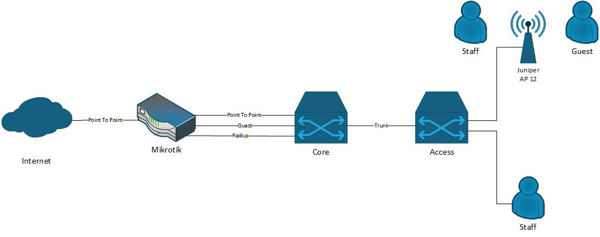

# Network-Enterprise-Lab
This lab is designed for hands-on enterprise networking practice using your actual hardware stack. It covers DNS, firewall policy control, network monitoring, and RADIUS-based wireless authentication.

---

# Lab Objectives
By completing this lab, you will be able to:
1. Provide DNS-based internet access using an internal Ubuntu DNS server
2. Implement firewall rules where:
    - Some subnets are allowed internet access by default
    - Some subnets require explicit allow rules
3. Deploy free Linux-based network monitoring
4. Implement WPA2-Enterprise wireless authentication using RADIUS
5. Practice layered design using L2, L3, firewall, and server roles

---

# Hardware & Software Used
Network Devices
- MikroTik Router – Internet gateway, firewall, NAT, RADIUS client
- Cisco C9300 – Layer 3 core switch
- Cisco C9300L – Layer 2 access switch
- Juniper AP12 – Wireless access point

Servers (on Proxmox)
- Ubuntu Server (DNS) – Internal DNS resolver & forwarder
- Ubuntu Server (Monitoring) – LibreNMS (or Zabbix)

Hypervisor
- Proxmox VE

---

# Network Design

### 1. IP Addressing and VLAN

|   VLAN    |      NAME     | IP Address      |
| --------- | ------------- | --------------- |
|     1     | MGMT          | 172.20.1.0/24   |
|    10     | WIRED         | 192.168.10.0/24 |
|    20     | GUEST         | 192.168.20.0/24 |
|    30     | WIRELESS      | 172.30.30.0/24  |
|    40     | SERVER        | 192.168.40.0/24 |

### 2. Hosts

|  DEVICE    |   HOSTNAME    | IP Address        |
| ---------- | ------------- | ----------------- |
|Mikrotik    | Mikrotik      | 172.20.1.1/24     |
|C9300       | Core          | 172.20.1.2/24     |
|C9300L      | Access        | 172.20.1.3/24     |
|AP12        | Lab           | 172.20.1.10/24    |
|Proxmox     | Proxmox Lab   | 192.168.40.10/24  |
|Ubuntu (DNS)| dns           | 192.168.40.100/24 |
|Ubuntu (NMS)| nms           | 192.168.40.101/24 |

---

# Component Roles & Configuration Overview

### 1. MikroTik Router
**Functions:**
  - Internet gateway
  - NAT masquerade
  - Stateful firewall
  - RADIUS (User Manager)
  - Gateway for GUEST user

**Key Design Point:**
  - Connected to C9300 via access link 
  - Does NOT participate in VLAN trunking

### 2. Cisco C9300 (Layer 3 Core)
**Functions:**
  - Inter-VLAN routing
  - Default gateway for all VLANs except for GUEST

**Key Design Point:**
  - No VLANs extended to MikroTik
  - Single inter vlan routing toward MikroTik

### 3. Cisco C9300L (Layer 2 Access)
**Functions:**
  - Access ports for users
  - Trunk to core and access point

### 4. Ubuntu DNS Server
**Software:**
  - DNSmasq

**Functions:**
  - Internal DNS resolution
  - Forwarding to public DNS (8.8.8.8/1.1.1.1)
> Clients use this DNS server to access the internet.

### 5. Ubuntu NMS Server
**Software:**
  - Zabbix

**Monitored Devices:**
  - Mikrotik
  - Switches
  - Juniper AP
  - Linux servers

### 6. RADIUS Authentication
**RADIUS Platform:**
  - MikroTik User Manager (built-in RADIUS)
  - MikroTik Local RADIUS service

**Function:**
  - WPA2-Enterprise (802.1X) authentication for WiFi users
  - Centralized user database on MikroTik
  - Optional bandwidth / session control per user
> This design keeps authentication centralized on the mikrotik router.

### 7. Firewall & Guest Access (Hotspot + Splash page)
**Guest access requirement:**
  - Guest VLAN uses captive portal (splash page)
  - Splash page is hosted directly on MikroTik
  - Internet access granted only after acceptance/login
  - Guest are not allow to access internal VLAN/Network

---
